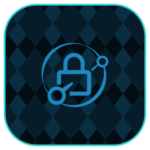

<p align="center">
  
</p>

# caddy

Caddy is a fast, automatic-HTTPS web server and reverse proxy.

A first-party [orca](https://github.com/argyle-labs/orca) plugin: first-class CRUD over an already-running Caddy instance's reverse-proxy routes (plus config read / reload / status) over its **admin API** — so you stop hand-editing the `Caddyfile`.

This repo is **self-contained** — the steps below run caddy **by hand, without orca**. orca then drives the running instance's routes through the tools below (and automates deploy/backup via the generic `service.*` surface).

---

## Run it without orca

### Docker Compose

```yaml
# compose.yml
services:
  caddy:
    image: caddy:latest
    container_name: caddy
    restart: unless-stopped
    ports:
      - "80:80/tcp"
      - "443:443/tcp"
      - "443:443/udp"   # HTTP/3
    volumes:
      - ./Caddyfile:/etc/caddy/Caddyfile
      - ./data:/data
      - ./config:/config
```

```sh
docker compose up -d
```

### Other runtimes

**Podman** — the compose above works with `podman compose up -d`, or run it directly:

```sh
podman run -d --name caddy --restart unless-stopped \
    -p 80:80/tcp \
    -p 443:443/tcp \
    -p 443:443/udp \
    -v ./Caddyfile:/etc/caddy/Caddyfile \
    -v ./data:/data \
    -v ./config:/config \
    caddy:latest
```

**LXC** — on a container-capable LXC (e.g. a Proxmox LXC with nesting enabled) run the same image via Docker/Podman as above, or install caddy from upstream directly on the guest: <https://caddyserver.com/>.

**VM** — install caddy from upstream (<https://caddyserver.com/>) or run the same container image inside the VM; expose port `80`.

**Unraid** — add via *Community Applications*, or *Docker → Add Container* with image `caddy:latest`, port `80`, and the volume paths above.

### Ports & data

| | |
|---|---|
| Default port | `80` |
| Upstream | <https://caddyserver.com/> |
| Operator notes | [caddy.md](docs/caddy.md) |


### Backup & restore

Back up the config/data volume(s) above — that's the whole service state (stop the container first for a clean copy). Restore by putting them back and starting it.

> With orca this is **`service.backup` / `service.restore`** — location-agnostic (docker / podman / lxc / vm), one command regardless of where caddy runs. No per-service backup script.

## With orca

Register a running Caddy instance as an endpoint (its `routes` point at the **admin API**, default `:2019`), then drive its reverse-proxy routes:

```sh
# Register the instance (routes are an ordered, reachable-first fallback list).
orca caddy.create --name edge \
    --route lan=http://10.0.0.5:2019 --insecure false --enabled true
orca caddy.list                                      # registered endpoints
orca caddy.status --name edge                        # reachable + server/route/upstream counts
orca caddy.config.get --name edge                    # full current config JSON

# Reverse-proxy routes (hostname → upstream)
orca caddy.route.list   --name edge
orca caddy.route.set    --name edge --host service.example.com --upstream 10.0.0.9:8080
orca caddy.route.set    --name edge --host service.example.com --upstream 10.0.0.9:8080,10.0.0.10:8080  # multiple upstreams
orca caddy.route.delete --name edge --host service.example.com
orca caddy.reload       --name edge                  # re-apply the running config
```

`caddy.route.set` is idempotent: an existing route for the host has its upstreams replaced in place, otherwise a new route is appended. Edits are surgical — only the target server's `routes` array is written back (`PATCH /config/apps/http/servers/<server>/routes`), leaving TLS automation and other apps untouched. When an instance has more than one http server, pass `--server <name>`.

The admin API is unauthenticated on `localhost:2019` by default. To drive it remotely, bind it to a reachable address in the Caddyfile global block (`admin 0.0.0.0:2019`) and — if you front it with auth — store the token in orca's secrets domain (`caddy.<endpoint>.api_key`, sent as a bearer token); `--insecure true` skips TLS verification for a self-signed https admin front-end.

> Deploy/backup ride the generic `service.*` surface: `orca service.deploy caddy`, `orca service.backup caddy` (location-agnostic; tar, or PBS on Proxmox). `service.status` / `service.configure` are planned.

## Layout

- `src/lib.rs` — the Caddy admin-API client (`Config`, config/route/reload ops) + the `ServiceBackend`.
- `src/tools.rs` — the `#[endpoint_resource]` registry + `caddy.*` tools.
- `src/main.rs` — the `Plugin` builder entrypoint (dual facet: service + tools).
- `docs/` — standalone operator notes.
- [CAPABILITIES.md](CAPABILITIES.md) — the plugin contract checklist.
- `assets/` — plugin icon.
